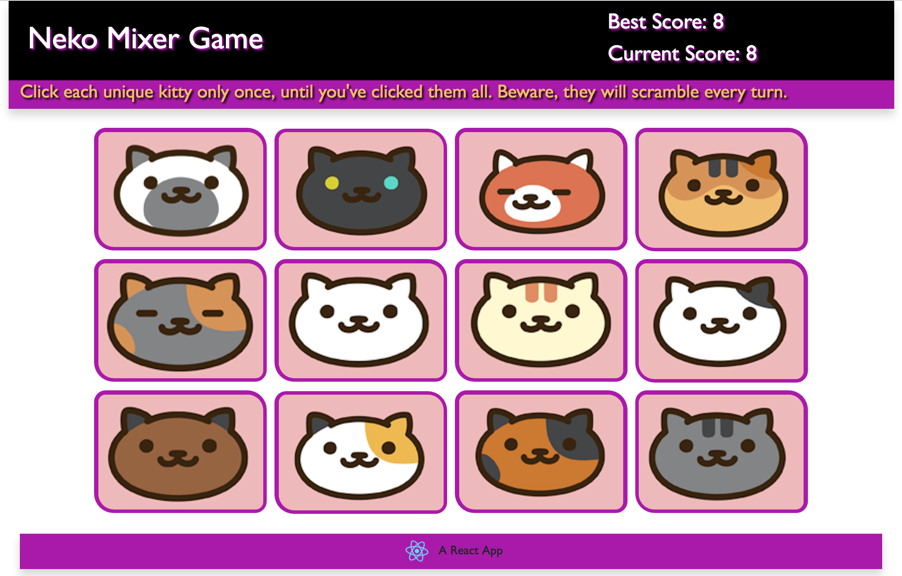

# ReactApp

This is a single page app built using React.js. The purpose of the game is to click on each individual image until they've each been clicked once. The game will end if an image is clicked more than one. After each click the images with shuffle order.

In-Game Screenshot:

App Website: http://www.victoriaraepaul.info/ReactApp/
